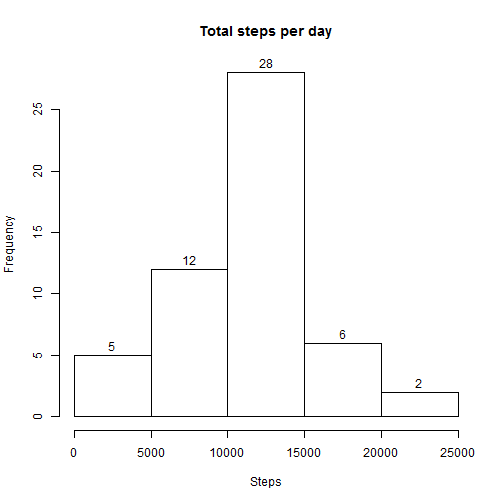
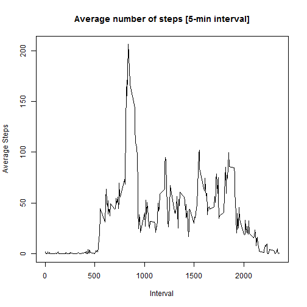
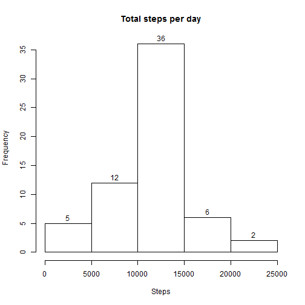
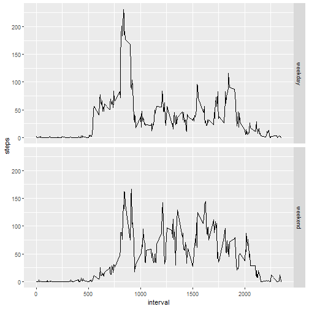

### Loading the necessary packages

```r
library(ggplot2)
library(knitr)
```

### Loading the data

```r
data <- read.csv("activity.csv", colClasses = c('numeric', 'factor', 'numeric'))
data <- transform(data, as.Date(date))
```

### Part of the assignment where the missing values are ignored
Calculating the total number of steps and making the histogram:

```r
tot_st <- aggregate(steps ~ date, data, sum, na.rm = TRUE)
hist(tot_st$steps, xlab = "Steps", ylab = "Frequency", main = "Total steps per day", labels = TRUE)
```




Calculating the mean and the median of the total number of steps taken per day:

```r
mean_st <- mean(tot_st$steps)
median_st <- median(tot_st$steps)

print(mean_st)
```

```
## [1] 10766.19
```

```r
print(median_st)
```

```
## [1] 10765
```

Average daily activity pattern.

```r
mean_steps <- aggregate(steps ~ interval, data, mean, na.rm = TRUE)
plot(mean_steps$interval, mean_steps$steps, type = "l",
                        main = "Average number of steps [5-min interval]",
                        xlab = "Interval", ylab = "Average Steps")
```



The maximum number of steps happens on average during the following 5-minute time interval:

```r
max_interval <- mean_steps[which.max(mean_steps$steps),1]
print(max_interval)
```

```
## [1] 835
```

Total number of missing values in the original dataset:

```r
tot_na <- sum(is.na(data))
print(tot_na)
```

```
## [1] 2304
```

### Imputing missing values
Filling in all the missing values with the mean steps of that interval:

```r
new_data <- as.data.frame(data)
for (i in 1:length(data$steps)) {
         if (is.na(new_data[i,1])) {
                new_data$steps[i] <- mean_steps[which(mean_steps$interval == new_data$interval[i]),2]
                 }
}
```

New histogram of total steps

```r
new_tot_st <- aggregate(steps ~ date, new_data, sum, na.rm = TRUE)
hist(new_tot_st$steps, xlab = "Steps", ylab = "Frequency", main = "Total steps per day", labels = TRUE)
```




Calculating the new mean and median of the total number of steps taken per day:

```r
new_mean_st <- mean(new_tot_st$steps)
new_median_st <- median(new_tot_st$steps)

print(new_mean_st)
```

```
## [1] 10766.19
```

```r
print(new_median_st)
```

```
## [1] 10766.19
```

The mean is the same as the one calculated for the data with the na values removed. This is expected since I have filled in the misisng values with the mean of that interval. The median is a bit higher.

Visualising the difference in patterns for weekdays and weekends:

```r
week_days <- as.Date(new_data$date)
wd <- weekdays(week_days)
new_data$weekday <- "weekday"
new_data$weekday[wd == "Saturday" | wd == "Sunday"] <- "weekend"
```

Creating a panel plot to show the differences in the average number of steps taken per day between the weekdays and the weekends.

```r
new_mean_steps <- aggregate(steps ~ interval+weekday, new_data, mean, na.rm = TRUE)

gg1 <- ggplot(new_mean_steps,aes(interval,steps))+geom_line()+facet_grid(weekday~.)
gg1
```


